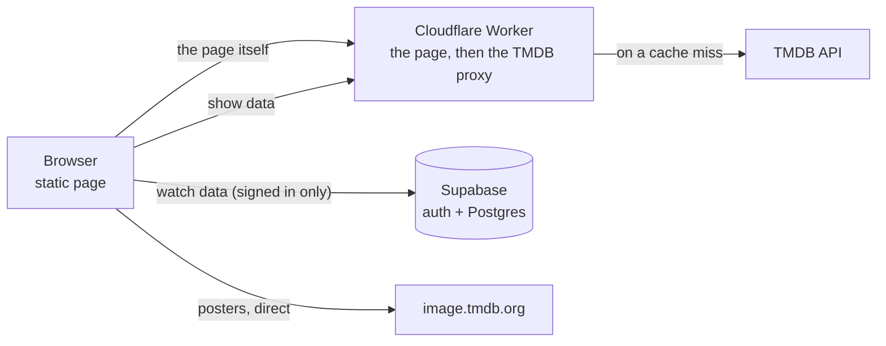

# Architecture

Start here.

ONAIR is a static page. Two services will stand behind it, and neither exists yet:

- **The client** renders everything and holds the watch data.
- **A Cloudflare Worker** serves the page, and later reads TMDB on its behalf.
- **Supabase** authenticates users and stores the watch data of those who sign in.

## Where things stand

The client keeps the watch data in `localStorage` and calls TMDB directly with a key
that each user pastes into the header.

## Setting this up for the first time

Read [the roadmap](roadmap.md) first. It splits the work into three steps that each ship
something usable, and it says why they are in that order.

Then, in order:

1. **Put the page on Cloudflare.** Read [hosting](hosting.md) for how one Worker serves files
   and later runs code, then follow `cloudflare.md` for the account, the repository connection
   and the commands. Nothing about the app changes at this step.
2. **Move the TMDB key into the Worker.** Read [show data](show-data.md) for what the proxy
   forwards, why it does not authenticate, and what the licence costs if this ever earns money.
3. **Add accounts.** Read [user data](user-data.md) for the two modes, the schema and the merge
   rules, then follow `supabase.md` for the project and the SQL.

## The documents

| | |
| --- | --- |
| [roadmap.md](roadmap.md) | The three steps, and why in that order |
| [hosting.md](hosting.md) | One Worker for the page and the API, and the three caching tiers |
| [show-data.md](show-data.md) | TMDB, the proxy, the abuse limits, the licence |
| [user-data.md](user-data.md) | Anonymous and signed in, the schema, the merge rules |
| [recommendations.md](recommendations.md) | How a suggestion is scored |

`cloudflare.md` and `supabase.md` sit at the root of the project rather than here. They are
runbooks — accounts, commands, keys — and they are kept out of the repository.
