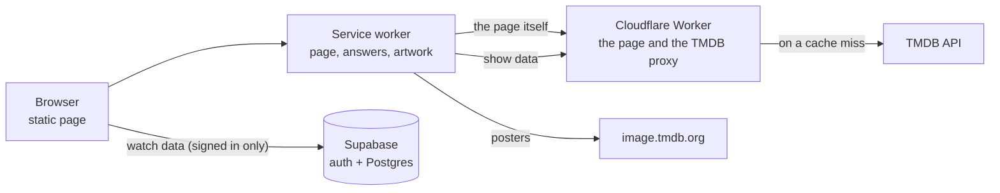

# Architecture

Start here.

ONAIR is a static page with two services behind it:

- **The client** renders everything and stores the watch data.
- **A Cloudflare Worker** serves the page and reads TMDB on its behalf.
- **Supabase** authenticates users and stores the watch data of those who sign in.

## What is kept where

**Only the watch progress is stored** — which episode you are on, what you made of the show,
and whether you dropped it. Everything else about a show is asked of TMDB on every load. That
one decision explains most of the system:

- `localStorage` stores a few numbers per show, not a library.
- A backup file is small, and contains nothing TMDB can say again.
- The Postgres table is one narrow row per show, so two devices marking two different shows
  never conflict.
- A browser with no network would know a list of ids and nothing else, which is why the
  service worker keeps the TMDB answers as well as the page.

Signing in is additive. The first sign in sends a library built with no account to the table,
and clears nothing.

## The documents

| | |
| --- | --- |
| [hosting.md](hosting.md) | One Worker for the page and the API, and the caching tiers |
| [show-data.md](show-data.md) | TMDB, the proxy, the abuse limits, the licence |
| [user-data.md](user-data.md) | Anonymous and signed in, the schema, the merge rules |
| [offline.md](offline.md) | Reading with no network, and writes that have not been sent |
| [episode-order.md](episode-order.md) | A note: the order of a series depends on who showed it |
| [recommendations.md](recommendations.md) | How a suggestion is scored, and how it says why |
| [roadmap.md](roadmap.md) | What was built, in what order, and what is left |

`cloudflare.md` and `supabase.md` sit at the root of the project rather than here. They are
runbooks — accounts, commands, keys — and they are kept out of the repository.
