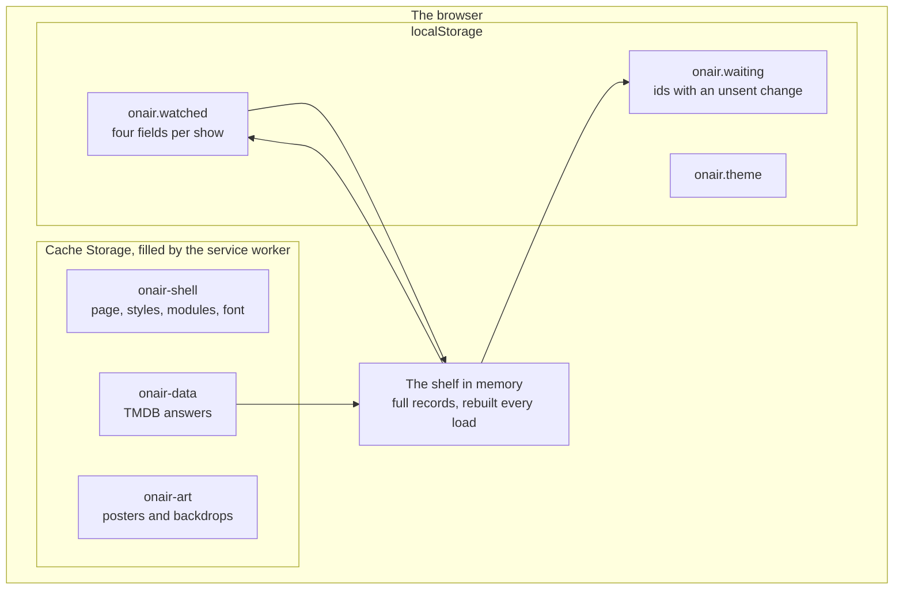
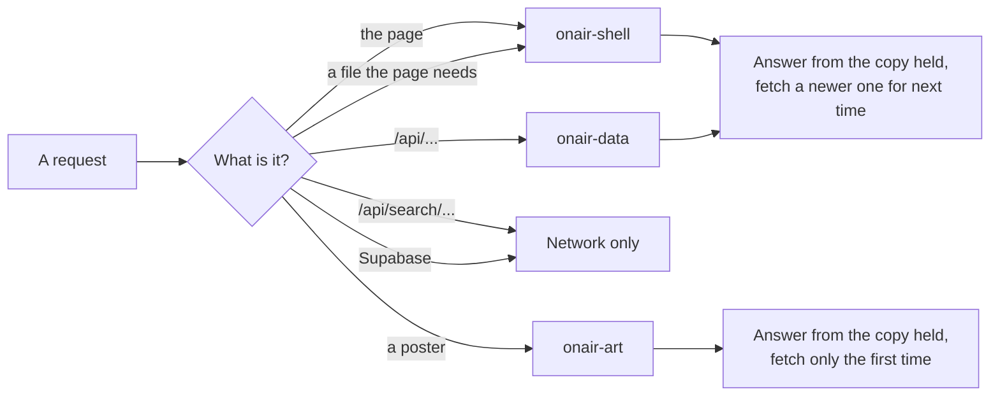
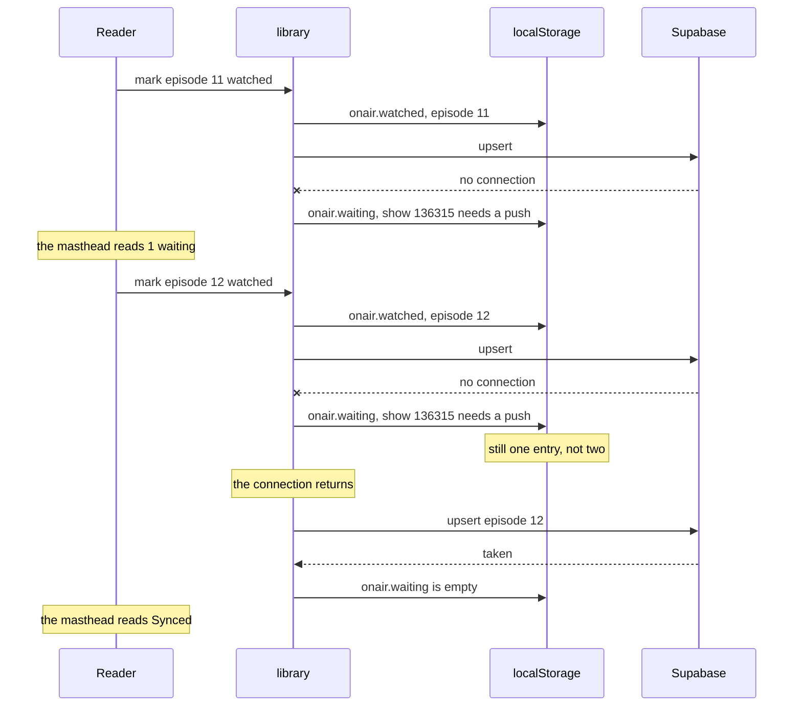
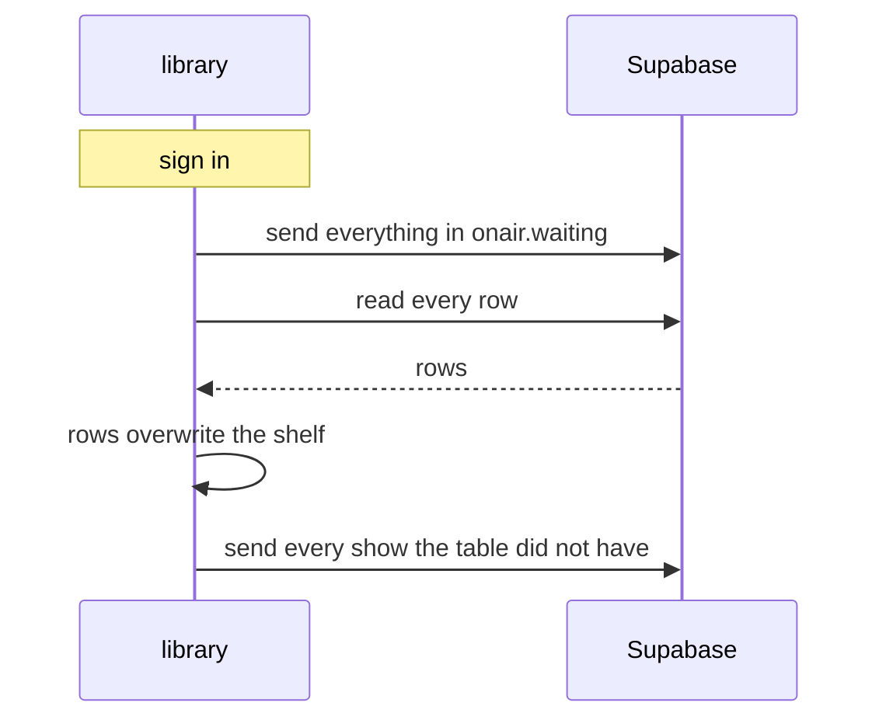

# Offline

How the app reads and writes when it cannot reach the network. This is the current state, not
a plan.

## Why it needs saying at all

Only the watch progress is stored: which episode you are on, what you made of the show, and
whether you dropped it. Four fields per show. Everything else — the title, the seasons, the air
dates, the artwork — is asked of TMDB on every load and thrown away.

That keeps the storage small and the backup file honest, but it has one consequence: **a
browser with no network knows a list of numbers.** Not a shelf with missing pictures. Sixty-odd
ids, no titles, nothing to draw.

So offline needs two separate things, and they fail in different directions:

| | Problem | Answer |
| --- | --- | --- |
| Reading | TMDB cannot be asked what a show is | the service worker keeps the answers |
| Writing | Supabase cannot be told what changed | the browser records which shows have an unsent change |

## What is stored, and where



`localStorage` is the truth about the reader. Cache Storage is a copy of what TMDB and the
Worker said, and can be deleted at any time with no loss.

## Reading

The service worker answers every request the page makes. Three caches, and one rule each.



**The page itself is answered from the cache, not from the network first.** Asking the network
first makes opening the app wait for a request to time out at exactly the moment the cache
exists for.

The cost is one stale load after a deploy. The worker compares the `ETag` of what it fetched
against the `ETag` of what it held; when they differ it messages the page, and the page offers
to start again. The page never changes while someone reads it. Cloudflare serves an `ETag` that is a
hash of the file, so this needs no version number and no build step to write one.

A search is not cached. It is typed once and the answer is never wanted again.

Posters are answered from the copy held and fetched only once, because a TMDB image address
names a size and a file that do not change.

## Writing

A change is written to `localStorage` first and sent to the table second. When the second half
fails, the show id is added to `onair.waiting`, against the word for the write it still needs:

```json
{ "136315": "push", "1408": "gone" }
```

`push` means the row has to be written. `gone` means the row has to be marked deleted. Nothing
else can be waiting.



### The list stores ids, not changes

This is the part worth being deliberate about. `onair.waiting` records **which** shows need a
write, never **what** the write is.

The shelf already stores what to send. A show in the list is read from the shelf at the moment
it is sent, so:

- Three marks made offline cost one write, not three.
- A change cannot go stale against the shelf, because it is read from the shelf at send time.
- Nothing has to be reconciled: there is one value per show, and it is the one on screen.

A removed show is the one exception. It is no longer on the shelf to read, so `gone` is the
whole of what there is to remember about it.

### Why a separate key and not a field on the show

`onair.watched` is filtered to four fields on every write, and those four fields are also what
the backup file contains and what the table row contains. A fifth field for "not sent yet"
would follow the show into the export and into Postgres, where it means nothing: whether *this*
browser managed to reach the table is a fact about the browser, not about the show.

Keeping it in `onair.waiting` also means a reader who never signs in never writes the key at
all.

### The order matters

The list is emptied when the browser fires `online`, and again on every sign in — and on sign
in **it runs before the pull**:



Reversing the first two steps loses data. The pull overwrites the shelf with the table's rows,
so a change that never left would be replaced by the older value it was meant to supersede —
and then sent back up over itself.

The last step is the same mechanism for a different case. A library built with no account has
no row in the table for any show, so the first sign in sends all of them.

## What this does not do

**It does not keep a history.** One entry per show, and that entry is one word. If a show is marked
five times offline, the table learns the fifth value and never learns that the first four
happened. For watch progress that is the right answer — the question is "where am I", not "how
did I get here" — but it does mean the app cannot answer "when did I watch this".

**It does not resolve conflicts.** A change sent late overwrites the row for that show. Two devices editing the same show while one is offline is settled by whoever writes
last, which is the same rule the table already uses. The realtime subscription keeps open tabs
level, but it cannot help a tab that was not listening.

**It does not survive a cleared browser.** `localStorage` is the only copy of an unsent change.

**Signed out, nothing waits.** There is no table to be behind, so the writes that fail are the
ones that were never attempted, and the count stays at zero.
